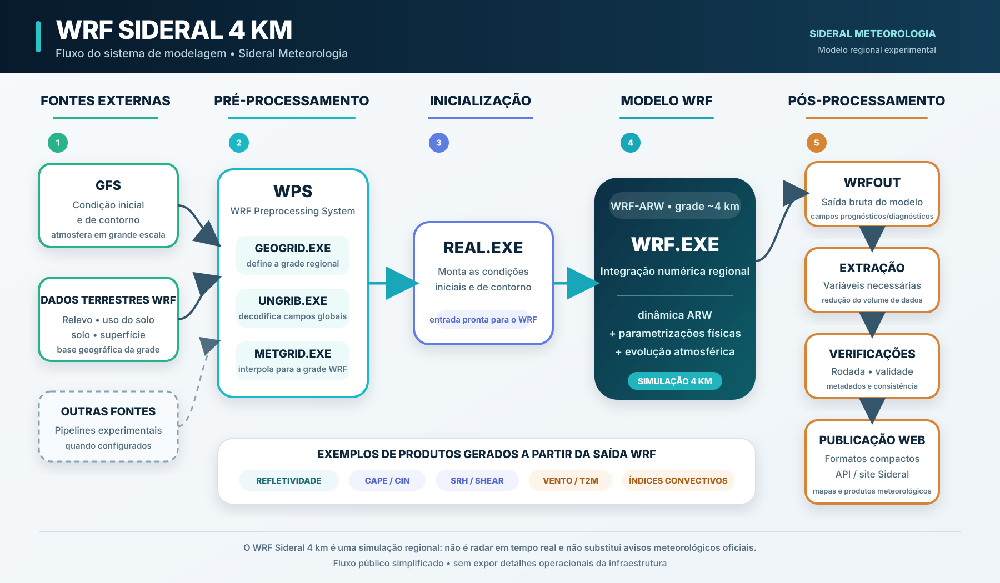

# Como funciona o WRF da Sideral

Nos últimos dias apareceram dúvidas sobre a origem das previsões WRF exibidas pela Sideral. Este texto existe para explicar o suficiente para que qualquer pessoa entenda o processo, sem transformar a documentação pública em um manual operacional da nossa infraestrutura.

## O que realmente é executado

A Sideral utiliza o **WRF-ARW**, um modelo numérico regional amplamente usado em pesquisa e previsão do tempo. Ele não cria a previsão do zero: precisa receber uma representação inicial da atmosfera e informações de contorno vindas de um modelo global.

No nosso caso, uma das configurações operacionais usa o **GFS** como condição inicial e de contorno. Também existem pipelines experimentais preparados para outras fontes globais. Usar o GFS como entrada não transforma o produto em "GFS com zoom". Depois da inicialização, o WRF resolve sua própria integração atmosférica dentro do domínio regional, com sua grade, dinâmica e parametrizações físicas.

## O caminho dos dados

Em linguagem simples, o fluxo é este:

**modelo global → preparação da grade regional → WPS → condições iniciais → execução do WRF → wrfout → pós-processamento → site**

O WPS prepara os campos meteorológicos e geográficos para a grade regional. Depois, `real.exe` monta as condições usadas pelo modelo e `wrf.exe` realiza a integração numérica propriamente dita. Ao final, são gerados arquivos `wrfout` com os campos previstos.

Esses arquivos são muito maiores do que o necessário para uma aplicação web. Por isso, uma etapa posterior lê somente as variáveis que precisamos, reduz o volume de dados e publica versões compactas para o site. A compactação ou conversão de formato não cria a previsão; ela apenas transforma a saída do modelo em algo que o navegador consegue carregar.

## Por que chamamos de WRF 4 km

Os aproximadamente **4 km** representam o espaçamento horizontal da grade configurada no domínio regional. Isso descreve a malha numérica, não a certeza da previsão.

Uma célula convectiva prevista em determinado ponto pode surgir alguns quilômetros ou algumas horas distante do observado, desaparecer completamente ou aparecer onde nada ocorre. Isso é uma limitação normal de previsão numérica convectiva e não muda o fato de que o modelo foi executado nessa grade.

## E a refletividade?

Nos produtos marcados como **REFL_10CM nativo**, a refletividade vem do diagnóstico produzido pelo próprio WRF durante a simulação. Ela é extraída dos arquivos gerados pelo modelo e convertida para o formato de publicação da Sideral.

Isso é diferente de:

- usar uma imagem de radar real como previsão;
- pegar a refletividade do GFS e apenas redimensioná-la;
- desenhar células manualmente;
- gerar manchas aleatórias para parecer radar.

A refletividade prevista continua sendo uma **simulação**, portanto não deve ser confundida com uma observação de radar.

## Como sabemos de qual rodada o produto veio

Cada publicação inclui metadados da rodada, como horário de inicialização, ciclo utilizado, validade dos quadros e origem da variável. O pipeline também faz verificações automáticas antes de considerar uma rodada publicável.

Nem toda execução termina com sucesso. Modelagem numérica pode falhar por indisponibilidade da entrada, limite computacional, erro de pré-processamento ou erro durante a integração. Quando isso acontece, a rodada pode ficar ausente ou incompleta até a próxima execução válida.

## Por que não publicamos todos os detalhes da infraestrutura

Transparência científica não exige expor cada detalhe operacional, credencial, arquitetura de execução ou mecanismo interno usado para manter o sistema funcionando. O que importa para entender a natureza do produto é deixar claro:

- qual modelo está sendo executado;
- qual é a origem das condições iniciais;
- que existe integração numérica regional;
- de onde vêm as variáveis publicadas;
- qual rodada e horário correspondem aos dados;
- quais são as limitações do produto.

É esse nível de transparência que buscamos manter.

## O que o WRF da Sideral não é

O produto não é um radar em tempo real e não substitui radares meteorológicos. Também não é uma previsão oficial de órgão governamental. É uma ferramenta numérica independente, experimental e em desenvolvimento, pensada para complementar análise de GFS, ECMWF, ICON, satélite, radar e observações.

Questionar um produto meteorológico é válido. A melhor resposta para isso é documentação, metadados e consistência técnica — não pedir que alguém simplesmente "acredite" na previsão.
